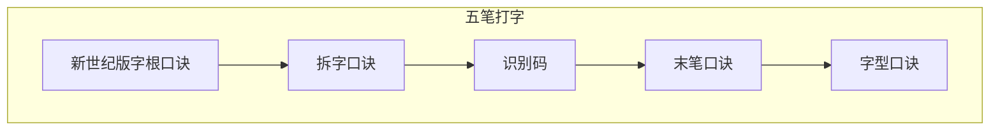

字根最好成绩：12 字 / 分钟；

```
1 区横起笔

11 G　王旁青头五一提
12 F　土士二干十寸雨
13 D　大三肆头古石厂
14 S　木丁西边要无女
15 A　工戈草头右框七

2 区竖起笔

21 H　目止具头卜虎皮
22 J　日曰两竖与虫依
23 K　口中两川三个竖
24 L　田框四车甲单底
25 M　山由贝骨下框几

3 区撇起笔

31 T　禾竹牛旁卧人立
32 R　白斤气头叉手提
33 E　月舟衣力豕豸臼
34 W　人八登祭风头几
35 Q　金夕犭儿包头鱼

4 区点起笔

41 Y　言文方点在四一
42 U　立带两点病门里
43 I　水边一族三点小
44 O　火变三态广二米
45 P　之字宝盖补示衣

5 区折起笔

51 N　已类左框心尸羽
52 B　子耳了也乃齿底
53 V　女刀九巡录无水
54 C　又巴甬矣马失蹄
55 X　幺母绞丝弓三匕
```