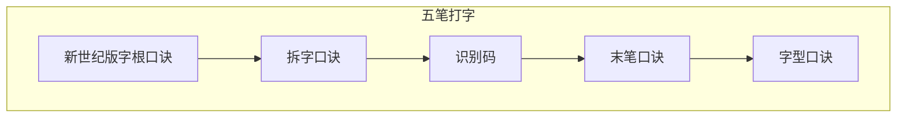

> 2021 年 3 月 24 日：梳理所有

[Rust 程序设计语言](https://kaisery.github.io/trpl-zh-cn/ch04-02-references-and-borrowing.html)

[rust 更新字符串](https://rust.bootcss.com/ch08-02-strings.html#%E6%9B%B4%E6%96%B0%E5%AD%97%E7%AC%A6%E4%B8%B2)

